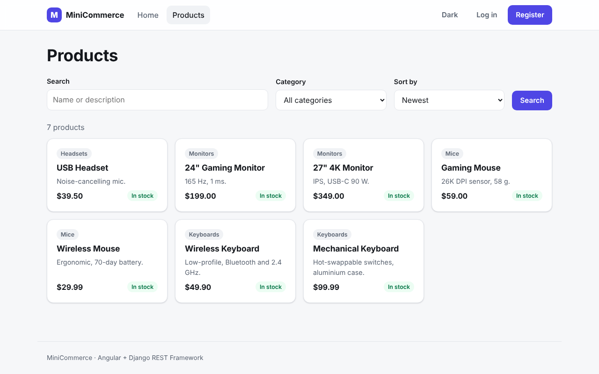
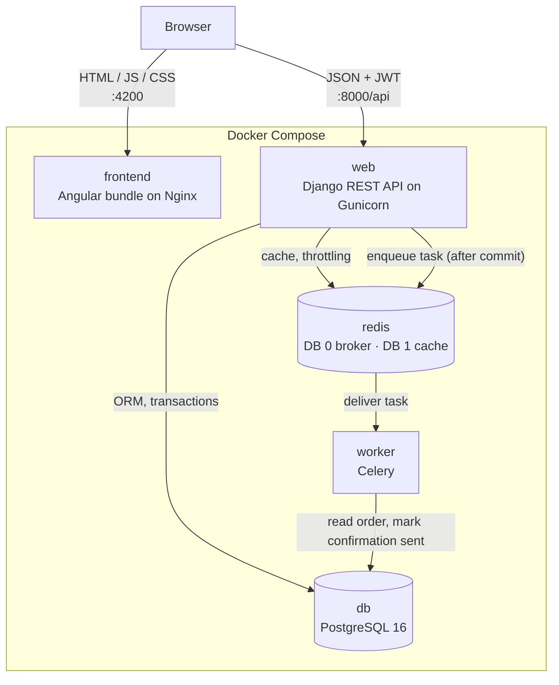
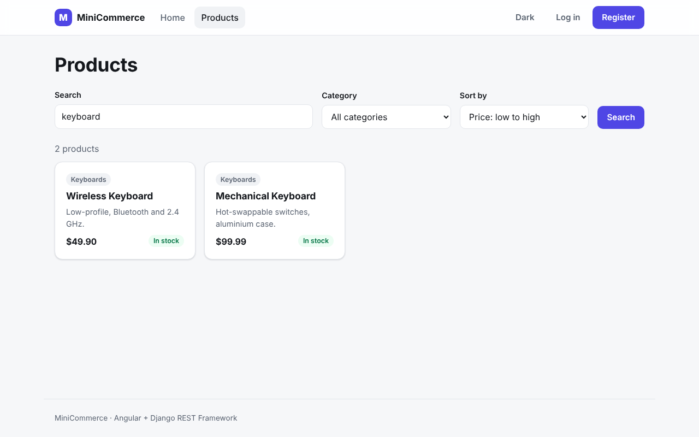
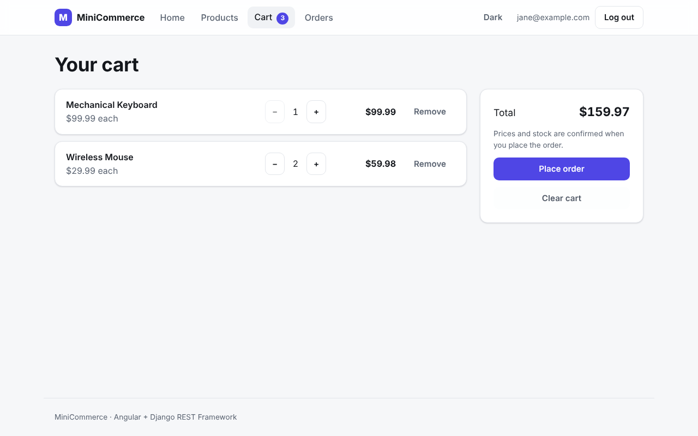
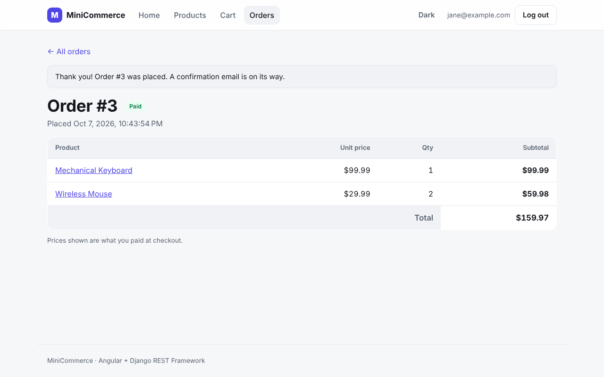
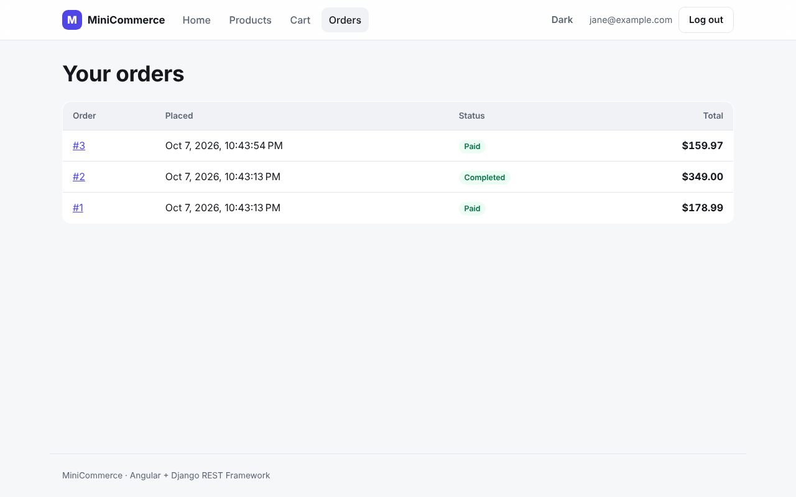
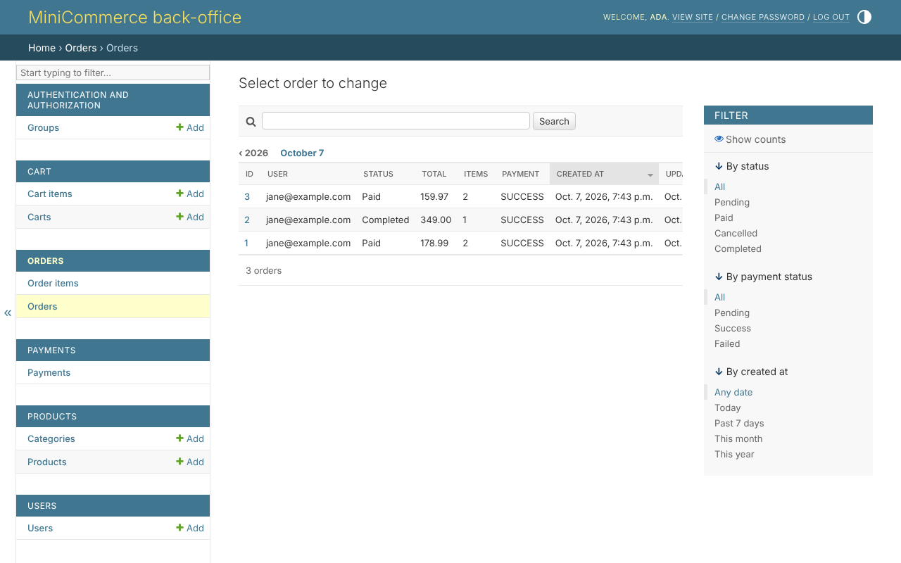
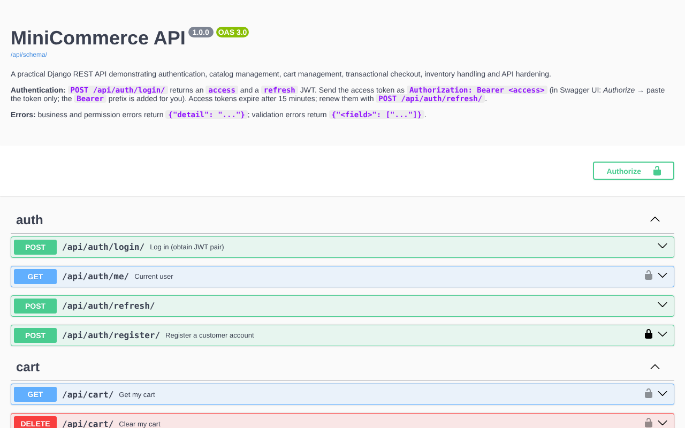

# MiniCommerce

[](https://github.com/Megawy/MiniCommerce/actions/workflows/ci.yml)

MiniCommerce is a production-style full-stack e-commerce platform: an Angular storefront on top of
a Django REST Framework API, backed by PostgreSQL, Redis and a Celery worker, and runnable as one
Docker Compose stack. It is a portfolio project built to show practical backend engineering —
transactional workflows, concurrency control, caching, background jobs — together with a clean,
modern Angular frontend.



**Contents:** [Features](#features) · [Architecture](#architecture) · [Checkout flow](#checkout-flow) ·
[Engineering decisions](#engineering-decisions) · [API](#api) · [Run it](#run-it-with-docker) ·
[Testing](#testing) · [Screenshots](#screenshots) · [Project structure](#project-structure) ·
[Developer guide](docs/DEVELOPMENT.md) · [Showcase](docs/SHOWCASE.md)

## Tech stack

| Layer | Technology |
|---|---|
| Frontend | Angular 22 (standalone components, signals, lazy routes, Reactive Forms), TypeScript, Vitest |
| Web server | Nginx (serves the compiled Angular bundle) |
| API | Python 3.13, Django 5.2, Django REST Framework, SimpleJWT, django-filter, drf-spectacular |
| App server | Gunicorn, WhiteNoise |
| Database | PostgreSQL 16 (psycopg 3) |
| Cache / broker | Redis 7 (django-redis) |
| Background jobs | Celery 5 |
| Testing | pytest + pytest-django, Vitest + jsdom |
| Tooling | Docker, Docker Compose, GitHub Actions |

## Features

- **Authentication** — email-based custom user model; register, login, refresh and "me" endpoints
  with JWT (15-minute access token, 1-day refresh token). Login/register are rate limited.
- **Catalog** — categories and products with search, category filter, price range, ordering and
  pagination. Inactive products are hidden from customers; staff manage the catalog.
- **Cart** — one cart per user; add (merging duplicate lines), change quantity, remove, clear.
  Totals are always computed on the server.
- **Checkout** — turns the cart into a paid order in one database transaction: stock is locked
  and validated, prices are snapshotted, inventory is deducted, the payment is recorded and the
  cart is emptied — or nothing happens at all.
- **Orders** — order history and detail, scoped to the owner (another user's order is a 404).
  Each line keeps the price paid at checkout.
- **Payments (mock)** — a `Payment` record per order through a mock provider, isolated in
  `apps/payments/services.py` so a real gateway could replace it.
- **Inventory** — stock is decremented at checkout under row-level locks; database check
  constraints keep stock, prices, quantities and totals non-negative.
- **Redis caching and throttling** — shared cache for the category list and for DRF throttle
  counters, so rate limits hold across all Gunicorn workers.
- **Background jobs** — Celery sends the order confirmation after the checkout transaction commits.
- **Django Admin** — a back-office for catalog, carts, orders and payments; financial history
  (orders, items, payments) is read-only.
- **OpenAPI** — generated schema with Swagger UI and ReDoc.
- **Angular storefront** — catalog with URL-driven filters, product pages, cart with live badge,
  checkout, order history, light/dark theme, responsive layout.

## Architecture



| Component | Responsibility |
|---|---|
| **Angular / Nginx** | Nginx serves the compiled single-page app (deep-link fallback, long-lived caching of hashed assets). The Angular code runs in the browser and calls the API directly. |
| **Django / Gunicorn** | The REST API, authentication, business rules (cart, checkout, permissions), Django Admin and the OpenAPI docs. Applies migrations on start. |
| **PostgreSQL** | Source of truth for users, catalog, carts, orders and payments. Constraints and row locks protect the data. |
| **Redis** | DB 0: Celery broker. DB 1: Django cache (category list, throttle counters). DB 2: test suite. Never holds authoritative data. |
| **Celery worker** | Runs work that should not slow down or break an HTTP request — currently the order confirmation. |

## Checkout flow

```
Angular                    POST /api/orders/checkout/   (button disabled while in flight)
  ↓
OrderViewSet.checkout      authentication + ownership; maps business errors to 400
  ↓
orders.services.checkout() the only service-layer function in the project
  ↓
transaction.atomic()
  ├─ SELECT … FOR UPDATE   lock the user's cart, then the cart's products (ordered by id)
  ├─ validate              active products, enough stock — read after the lock
  ├─ create Order + OrderItems with the current price as a snapshot
  ├─ decrement stock
  ├─ process_payment()     mock provider; a failure rolls everything back
  └─ empty the cart
  ↓
COMMIT (PostgreSQL)
  ↓
transaction.on_commit()  →  send_order_confirmation.delay(order_id)
  ↓
Redis (DB 0)  →  Celery worker  →  idempotent task sets Order.confirmation_sent_at
```

**Why the task is queued after commit.** If the task were queued inside the transaction, a
worker could pick it up before the commit and find no order, or the transaction could roll back
after the message was sent and the customer would be told about an order that never existed.
`transaction.on_commit()` only queues the message once the order is durable; a rolled-back
checkout queues nothing. The task receives just the order id, re-reads the order, and sets
`confirmation_sent_at` with a conditional `UPDATE`, so a retried or duplicated message never
notifies twice. If the broker is unreachable, the committed order still succeeds and the
failure is logged.

## Engineering decisions

- **PostgreSQL is the source of truth.** Stock, carts, orders and payments are never cached.
  Redis can be flushed or restarted at any time; the app falls back to the database.
- **Django ORM directly for CRUD.** Catalog, cart and order reads are ViewSets, serializers and
  querysets — no repository or unit-of-work layer on top of an ORM that already is one.
- **A service layer only where there is a workflow.** Checkout spans several aggregates and
  must be all-or-nothing, so it lives in `apps/orders/services.py`; nothing else needs one.
- **`select_for_update()` protects inventory.** Concurrent checkouts for the same product
  serialize on the product rows, so stock cannot be oversold (covered by a concurrency test
  that fails when the lock is removed). Rows are locked in a fixed order to avoid deadlocks.
- **`transaction.atomic()` makes checkout atomic.** A stock problem, a declined payment or a
  database error leaves no partial order, stock change or payment behind.
- **`OrderItem` stores the price paid.** Orders are financial history: changing a product's
  price later must not change past orders. Ordered products and categories are `PROTECT`ed
  and are deactivated rather than deleted.
- **Redis for distributed cache and throttling.** Throttle counters in a per-process cache
  would multiply the limit by the number of Gunicorn workers; a shared cache keeps it honest.
- **Celery for background jobs**, with **`transaction.on_commit()`** so a job never runs
  before (or without) the data it depends on.
- **Angular feature services, not generic repositories.** `ProductService`, `CartService`,
  `OrderService`, … each wrap the endpoints of one feature; no `ApiService<T>` abstraction.
- **No NgRx.** The only shared client state is the session and the cart badge — two signals.
  The server stays authoritative: after every cart change the cart is re-read, not recomputed.
- **Docker Compose for local orchestration.** Five services, health checks, start ordering and
  a persistent database volume; ports bound to `127.0.0.1`, database and Redis not published.

## API

Interactive documentation is generated from the code by drf-spectacular:

| URL | |
|---|---|
| `/api/docs/` | Swagger UI |
| `/api/redoc/` | ReDoc |
| `/api/schema/` | OpenAPI 3 schema (JSON) |

| Area | Endpoints | Access |
|---|---|---|
| Authentication | `POST /api/auth/register/` · `POST /api/auth/login/` · `POST /api/auth/refresh/` · `GET /api/auth/me/` | public (login/register throttled) · `me`: authenticated |
| Products | `GET /api/products/` · `GET /api/products/{id}/` — filters: `search`, `category` (slug), `min_price`, `max_price`, `ordering`, `page`, `page_size` | read: public · write (`POST`/`PUT`/`PATCH`/`DELETE`): staff |
| Categories | `GET /api/categories/` · `GET /api/categories/{id}/` | read: public · write: staff |
| Cart | `GET /api/cart/` · `DELETE /api/cart/` · `POST /api/cart/items/` · `PATCH /api/cart/items/{id}/` · `DELETE /api/cart/items/{id}/` | authenticated (own cart) |
| Orders | `GET /api/orders/` · `GET /api/orders/{id}/` | authenticated (own orders) |
| Checkout | `POST /api/orders/checkout/` → `201` with the order | authenticated |
| Health | `GET /api/health/` | public |

Errors use DRF's shapes: `{"detail": "…"}` for business and permission errors,
`{"field": ["…"]}` for validation errors.

## Run it with Docker

Requires Docker with Compose v2.

```powershell
copy .env.example .env      # set SECRET_KEY, POSTGRES_PASSWORD and DEMO_PASSWORD
docker compose up -d --build
docker compose exec web python manage.py seed_demo   # optional demo data
```

| URL | |
|---|---|
| http://localhost:4200 | Angular storefront |
| http://localhost:8000/api/ | REST API |
| http://localhost:8000/api/docs/ | Swagger UI |
| http://localhost:8000/admin/ | Django Admin |

| Service | Role |
|---|---|
| `frontend` | Nginx serving the Angular production build |
| `web` | Django + Gunicorn (API, admin, docs); runs migrations on start |
| `worker` | Celery worker |
| `redis` | Celery broker and Django cache |
| `db` | PostgreSQL with a persistent volume |

```powershell
docker compose ps                  # all services healthy
docker compose logs worker         # order confirmation tasks
docker compose exec web pytest     # backend test suite inside the container
docker compose down                # stop (the database volume is kept)
```

`seed_demo` creates `admin@example.com` (staff), `jane@example.com` and `bob@example.com` with
the password from `DEMO_PASSWORD`, plus a small catalog and two orders. Running without Docker,
and every other operational detail, is covered in the [developer guide](docs/DEVELOPMENT.md).

## Testing

| Suite | Tests | Command |
|---|---|---|
| Django (pytest + pytest-django, real PostgreSQL) | 232 | `pytest` or `docker compose exec web pytest` |
| Angular (Vitest + jsdom) | 63 | `cd frontend; npm test` |

The backend suite covers authentication and throttling, permissions and object ownership,
catalog filtering and caching, cart rules, checkout (rollback on every failure path, a real
two-thread concurrency test for the stock lock, price snapshots), Celery tasks
(enqueued only after commit, idempotency, broker outage), admin and OpenAPI generation.
The frontend suite covers the auth service, interceptor (token refresh, retry, logout) and
guards, the feature services, and the catalog, cart, checkout and order pages.

[GitHub Actions](.github/workflows/ci.yml) runs both suites, a Django system check, the Angular
production build and both Docker image builds on every push and pull request.

## Screenshots

| Catalog search | Cart |
|---|---|
|  |  |
| **Checkout result** | **Order history** |
|  |  |
| **Django Admin** | **Swagger UI** |
|  |  |

More in [docs/screenshots](docs/screenshots/) and the [project showcase](docs/SHOWCASE.md).

## Project structure

```
apps/
  users/      custom user (email login), JWT auth endpoints, seed_demo command
  products/   categories, products, filters, category cache
  cart/       cart and cart items
  orders/     orders, checkout service, Celery task
  payments/   payment model and mock provider
common/       pagination, permissions, exception handler, OpenAPI helpers, health check
config/       settings (base / dev / test / prod), URLs, Celery app
tests/        cross-cutting tests (permissions, cache, admin, OpenAPI docs, CORS)
frontend/     Angular application (core / shared / layout / features), Dockerfile, nginx.conf
docs/         developer guide, showcase, screenshots
```

## Known limitations

- Payments are mocked; there is no real payment provider or refund flow.
- The confirmation "email" is a log line; no email backend is configured.
- JWTs are stored in `localStorage` for simplicity (see the trade-off in the
  [developer guide](docs/DEVELOPMENT.md#frontend)).
- The Docker setup is for local use: no TLS, no reverse proxy, no production secrets management.
- An order placed while the broker is unreachable does not get its confirmation re-sent.

See [CHANGELOG.md](CHANGELOG.md) for the release history.
