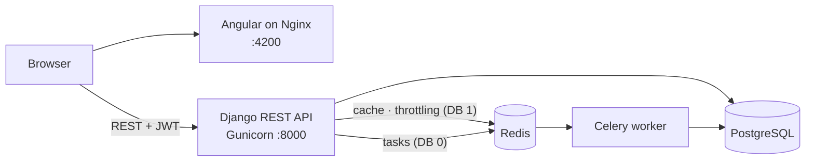
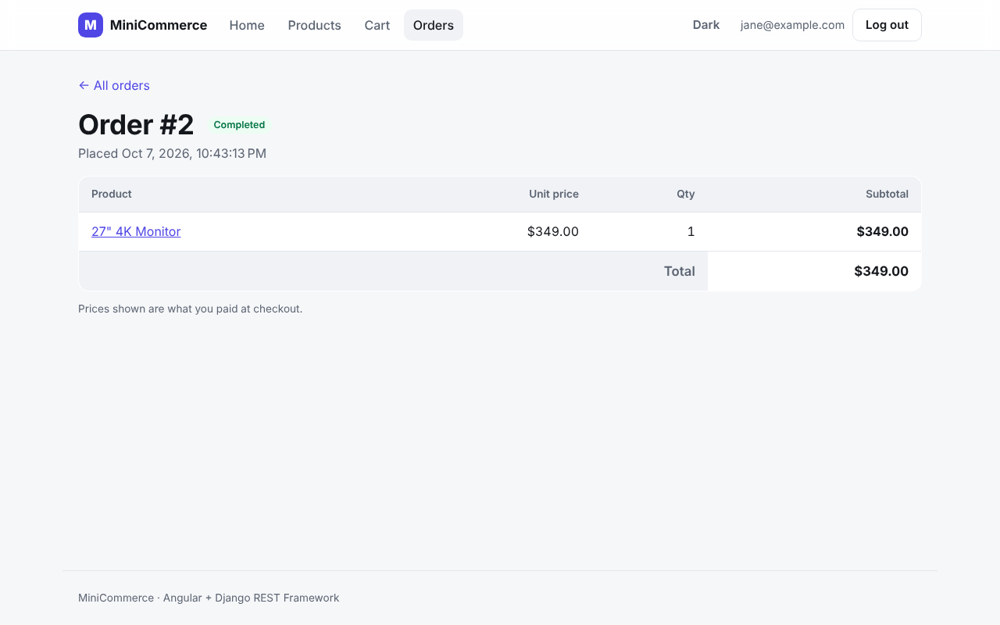
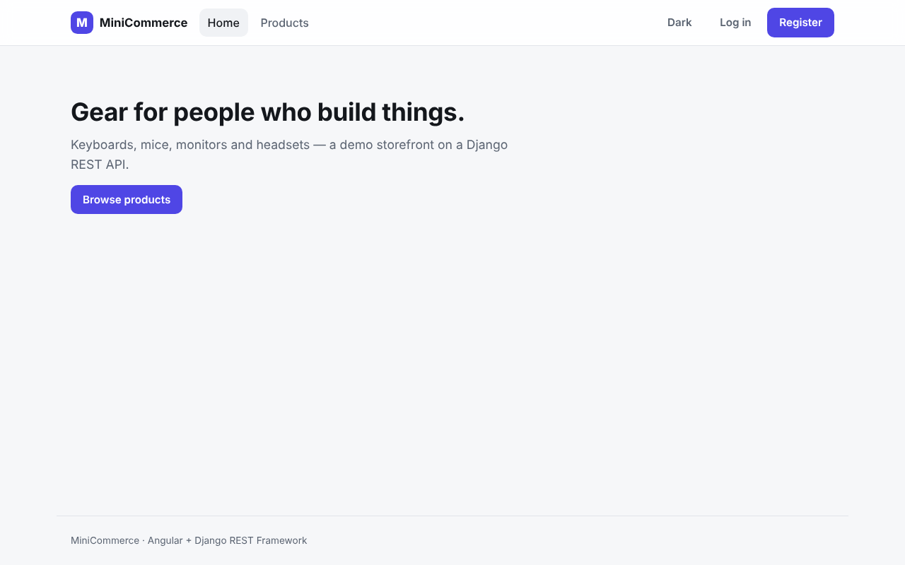
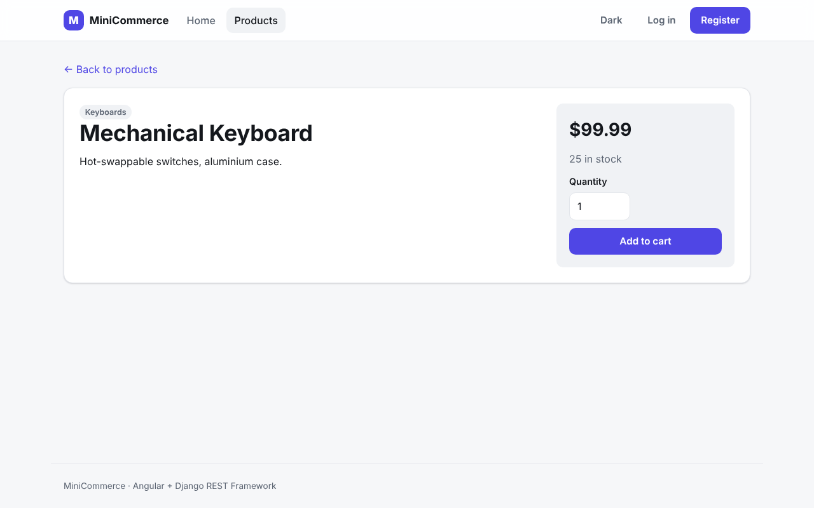
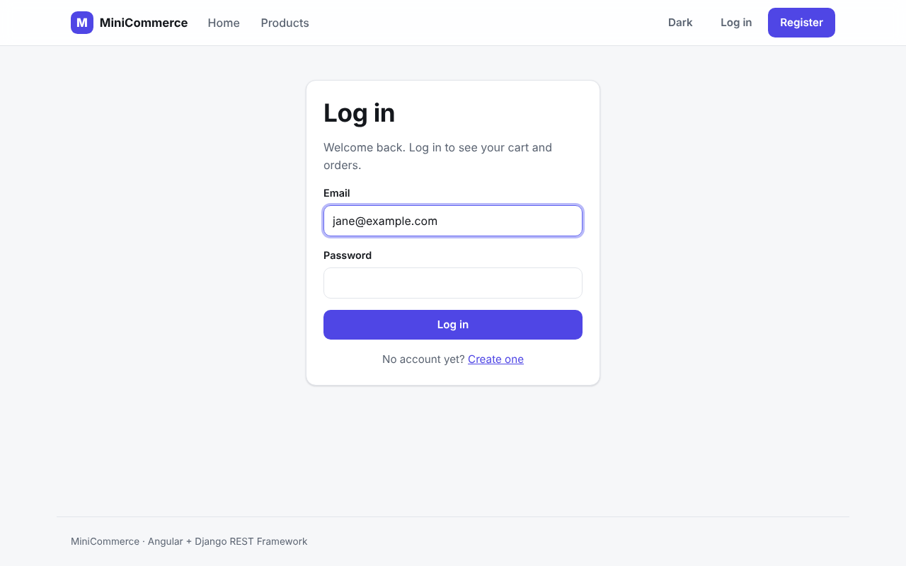
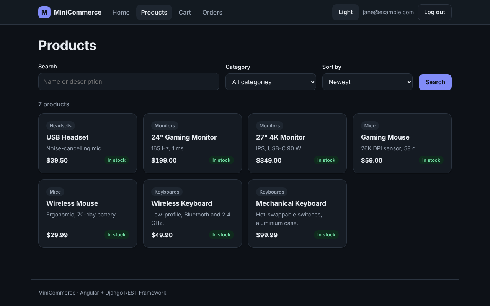

# MiniCommerce — Project Showcase

A guided tour for reviewers: what the system does, how it is built, and where to look in the code.
For setup and operations, see the [README](../README.md) and the [developer guide](DEVELOPMENT.md).

## Project overview

MiniCommerce is a full-stack e-commerce application: customers browse a catalog, fill a cart,
check out and review their orders; staff manage the catalog and inspect orders in a back-office.
The backend is a Django REST Framework API on PostgreSQL, with Redis for caching and rate
limiting and a Celery worker for background jobs. The frontend is an Angular 22 single-page
application served by Nginx. The whole system runs with one `docker compose up`.

The scope is deliberately small — one storefront, a mock payment provider — so that the
engineering around it can be done properly: transactions, locking, constraints, idempotent jobs,
tests, documentation and containerization.

## What this project demonstrates

- **REST API design** — resource-oriented endpoints, consistent error shapes, pagination,
  filtering and ordering, object-level ownership (another user's order is a 404, not a 403).
- **JWT authentication** — email login, short-lived access tokens, refresh flow handled
  transparently by an Angular HTTP interceptor (one shared refresh for concurrent 401s).
- **Transactional checkout** — order creation, stock deduction, payment and cart clearing in a
  single `transaction.atomic()` block; every failure path is tested to leave no trace.
- **Concurrency control** — `SELECT … FOR UPDATE` on cart and product rows, locked in a fixed
  order; a two-thread test proves stock cannot be oversold and fails if the lock is removed.
- **Database constraints** — check constraints (non-negative stock, prices, totals; positive
  quantities), a unique product per cart, `PROTECT` on financial history.
- **Distributed caching** — Redis-backed Django cache for the category list (invalidated on
  commit) and for DRF throttle counters shared by all Gunicorn workers.
- **Background jobs** — Celery task queued with `transaction.on_commit()`, idempotent via a
  conditional `UPDATE`, resilient to a broker outage.
- **Angular frontend architecture** — standalone components, signals, `rxResource`, lazy
  feature routes, functional guards and interceptor, feature services, URL-driven filter state,
  centralized error mapping, accessible markup, light/dark theme.
- **Docker orchestration** — five services with health checks, start ordering, a persistent
  volume, localhost-only ports, multi-stage frontend image (Node build → Nginx).
- **Automated testing** — 232 Django tests against real PostgreSQL, 63 Angular unit tests,
  GitHub Actions CI.
- **OpenAPI documentation** — schema, Swagger UI and ReDoc generated from the code.

## Architecture



The browser loads the Angular bundle from Nginx and then talks to Django directly; Nginx does
not proxy the API. PostgreSQL is the only source of truth — Redis holds disposable data (cache
entries, throttle counters, queued messages).

## Core flows

### Browse and search


Search, category, ordering and page live in the URL (`/products?search=keyboard&ordering=price`),
so filtered views survive a reload and can be shared. Filtering, search and pagination run in
Django (`django-filter`, DRF `SearchFilter`/`OrderingFilter`); the client only renders results.

### Cart


Every change (add, quantity, remove, clear) is followed by a fresh `GET /api/cart/`: the server
calculates subtotals and totals from current prices, and the header badge is a signal derived
from that response. Adding to the cart while signed out redirects to login and back.

### Checkout


`POST /api/orders/checkout/` runs `apps/orders/services.py::checkout`:

1. Lock the user's cart row, then the cart's product rows (`select_for_update`, ordered by id).
2. Validate stock and availability against the locked rows.
3. Create the order and its items, copying each product's current price into `OrderItem.price`.
4. Decrement stock, record the payment through the mock provider, empty the cart.
5. Commit — and only then queue `send_order_confirmation` with `transaction.on_commit()`.

The Angular button is disabled while the request is in flight, so a double click sends one
request; the backend's cart lock would make a second request find an empty cart anyway.

### Order history




Orders are scoped to their owner. Order lines show the price that was paid, even if the
catalog price has changed since.

### Back-office and API documentation


Django Admin is the internal back-office: catalog management with search and filters, and
read-only financial history (orders, items, payments) where only an order's status can change.
Swagger UI and ReDoc are generated by drf-spectacular, including the JWT security scheme.

### More screenshots

| | |
|---|---|
|  |  |
|  |  |
|  | |

All screenshots are taken from the running application with the `seed_demo` data set.

## Engineering decisions

| Decision | Reasoning |
|---|---|
| ORM directly for CRUD, a service only for checkout | Most endpoints are a queryset and a serializer; checkout is the one multi-step workflow that needs an explicit transaction boundary. |
| Row locks instead of optimistic retries | Checkout is short and contention is per product; `select_for_update` is simple to reason about and to test. |
| Price snapshot on `OrderItem` | Orders are financial records and must not change when the catalog does. |
| `PROTECT` and deactivation instead of deletes | Products, categories and users that appear in orders cannot be deleted; they are deactivated. |
| Redis as cache, never as source of truth | Losing Redis loses cache entries and queued notifications, never business data. |
| `transaction.on_commit()` for tasks | A worker must never see an order that is not committed, and a rollback must not leave a sent notification. |
| Idempotent task with a conditional `UPDATE` | Celery may deliver a message more than once (`acks_late`); the customer is notified at most once. |
| Feature services and signals in Angular, no NgRx | Shared client state is the session and a cart badge; a store would be more code than the problem. |
| Server-authoritative cart | The client never recomputes totals, so it can never disagree with the order it creates. |
| Separate settings modules (`dev`, `test`, `prod`) | Production defaults are safe (`DEBUG=False`, HTTPS redirect, secure cookies); development stays convenient. |

## Testing

- **Django — 232 tests** (pytest + pytest-django, real PostgreSQL): authentication, throttling,
  permissions and ownership, catalog filters and cache invalidation, cart rules, checkout
  rollback on each failure path, the threaded stock-locking test, price snapshots, Celery
  enqueue-after-commit and idempotency, broker outage, admin, OpenAPI schema, CORS.
- **Angular — 63 tests** (Vitest + jsdom): auth service and session restore, interceptor
  (bearer token, refresh, retry once, logout on failure), guards, feature services, error
  mapping, and the catalog, product, cart/checkout and order pages.
- **CI** — GitHub Actions runs both suites, `manage.py check`, a migrations check, the Angular
  production build and both Docker image builds.

## Docker

```powershell
copy .env.example .env      # SECRET_KEY, POSTGRES_PASSWORD, DEMO_PASSWORD
docker compose up -d --build
docker compose exec web python manage.py seed_demo
```

| Service | Purpose |
|---|---|
| `frontend` | Nginx serving the Angular production build on `127.0.0.1:4200` |
| `web` | Django + Gunicorn on `127.0.0.1:8000`; migrations on start |
| `worker` | Celery worker (no ports) |
| `redis` | broker + cache (not published) |
| `db` | PostgreSQL 16 with a named volume (not published) |

## Future improvements

- Real payment provider integration with webhooks, refunds and a `FAILED` payment history.
- Transactional outbox so notifications survive a broker outage, plus real email delivery.
- Refresh token in an `HttpOnly` cookie instead of `localStorage`, and a strict CSP.
- Order cancellation that returns stock, and an order status timeline.
- Product images and a richer catalog (variants, inventory reservations during checkout).
- End-to-end browser tests (Playwright) in CI against the Compose stack.
- Production deployment: reverse proxy with TLS, managed PostgreSQL/Redis, secrets management,
  structured logging and metrics.
